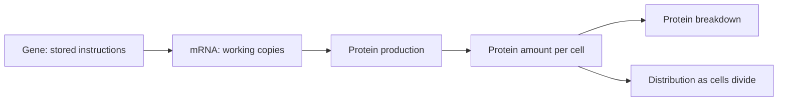

# Gene Regulation Under Conflicting Evidence

**Why does a cell contain more protein? A case study in reading biological evidence.**

Researchers notice that cells exposed to a compound contain three times as much of a particular protein. They suggest a simple explanation: the compound stops the protein from being broken down. But do their measurements support that conclusion?

This project follows that question through four sets of experimental evidence. The challenge is to distinguish what the measurements show from what the researchers assume.

The portfolio contains eight linked questions, explained reference answers, a 40-point scoring rubric, simulated evidence tables, methodological references and one completed Claude pilot.

**All measurements are simulated. Compound X, protein R and reference transcript H are fictional.** The experimental controls are assumptions of the scenario; no laboratory experiments were performed for this project.

## Start here

New to molecular biology? Read the short explanation below, then explore the case. For a technical review, follow these four steps:

1. **The problem:** [Read the case and eight questions](task/case.md).
2. **The reasoning:** [Work through the explained answers](task/reference-answer.md).
3. **The assessment:** [See how answers earn credit](task/rubric.md).
4. **The trial:** [Review Claude's result](evaluation/claude/pilot-report.md) alongside its [original response](evaluation/claude/claude-response.md).

Source markers such as [S1] in the case and answers refer to the [annotated references](evidence/references.md).

## The biology in plain language

A gene contains instructions for making a protein. A cell copies those instructions into **messenger RNA (mRNA)**, then uses the RNA to build the protein. Proteins also get broken down. When cells divide, existing protein is distributed among more cells.

The amount of protein in a cell depends on all of these processes. Finding more protein does not, by itself, tell us which process changed.

| Evidence | What it measures | Why it needs careful interpretation |
|---|---|---|
| A: Messenger RNA | The amount of the protein's RNA instructions | The reference used for comparison also changes, hiding an increase. |
| B: Newly made RNA | RNA produced during a short labeling period | Different recovery during purification can hide a real difference. |
| C: Protein and an inhibitor experiment | Protein amount and apparent disappearance after an attempted production block | The block is incomplete, so new protein is still being made. |
| D: Labeled protein over time | What happens to a pre-existing group of protein molecules | Protein per cell falls through both breakdown and cell division. |

In the case, **compound X** means the treatment being tested, **protein R** means the protein being measured, and **H** is the RNA reference used for comparison. The letters do not imply known identities or functions.

## Scientific reasoning demonstrated

| Skill | Application in the case |
|---|---|
| Experimental interpretation | Identify an unstable RNA reference, unequal purification recovery and incomplete synthesis blockade. |
| Quantitative analysis | Separate degradation from growth dilution and reconcile protein abundance with synthesis. |
| Mechanistic reasoning | Distinguish a conditional model inference from evidence of a direct molecular target. |
| Experimental design | Propose controlled tests of synthesis per mRNA and endogenous regulatory-element dependence. |
| Scientific assessment | Define credit criteria, evaluate a model response and document unsupported additional claims. |

## Central result

**The protein increase has more than one explanation:** cells make protein faster, break it down more slowly and divide more slowly. The original claim that reduced breakdown alone explains the result is not supported.

Under the supplied assumptions, corrected mature RNA and newly made RNA each increase twofold. Degradation-only half-lives change from 6 to 8 hours; growth dilution also slows. The steady-state model gives twice the protein synthesis flux and a 1.5-fold abundance contribution from lower total clearance, together explaining threefold protein abundance. Effective synthesis per mRNA is unchanged as a net model inference.

Here, **half-life** is the time taken for an amount to fall by half. **Steady state** means the average amount per cell stays stable over the measurement window. **Clearance per cell** combines protein breakdown with dilution as cells divide. The full calculations are in the reference answers.

## Claude pilot

One response was collected on **8 October 2026** using Claude's web interface, with the visible labels **Sonnet 5.5** and **Medium**. The original case was supplied without the reference answers, rubric or corrective feedback. The [submitted prompt](evaluation/claude/prompt.txt), [response](evaluation/claude/claude-response.md), [question-level scores](evaluation/claude/scores.csv) and [assessment](evaluation/claude/pilot-report.md) are included.

**Provisional score: 39/40.** Claude recovered the central calculations. The assessment also records an unsupported inhibitor-chase correction and imprecise attribution of separate clearance effects. The original rubric was retained when scoring; it was not revised after seeing the response.

This is one pilot response to a scaffolded case, not a general model ranking. The task's intended level is graduate-level reasoning; difficulty and discrimination have not been established by this single result. Model labels are those shown by the interface; exact backend and sampling settings were not exposed.

## Evidence and reproducibility

- [Simulated-data provenance](data/PROVENANCE.md) explains how the measurements were constructed.
- [Calculation checks](evidence/calculation-checks.json) record fold changes, rate constants and half-lives; the case supplies the equations needed to reproduce them without coding.
- [Scientific review](evidence/scientific-review.md) maps each question to methodological sources and records completed checks.
- [References](evidence/references.md) distinguish methodological evidence from invented measurements.

Version 1.0 · Prepared 8 October 2026
